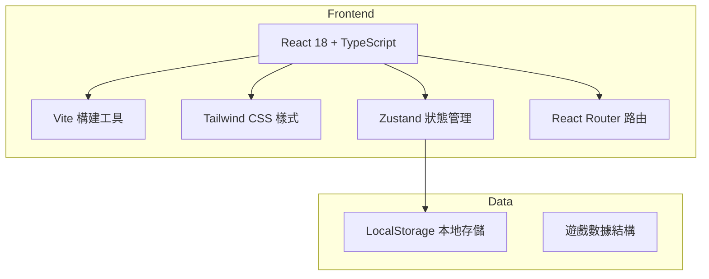
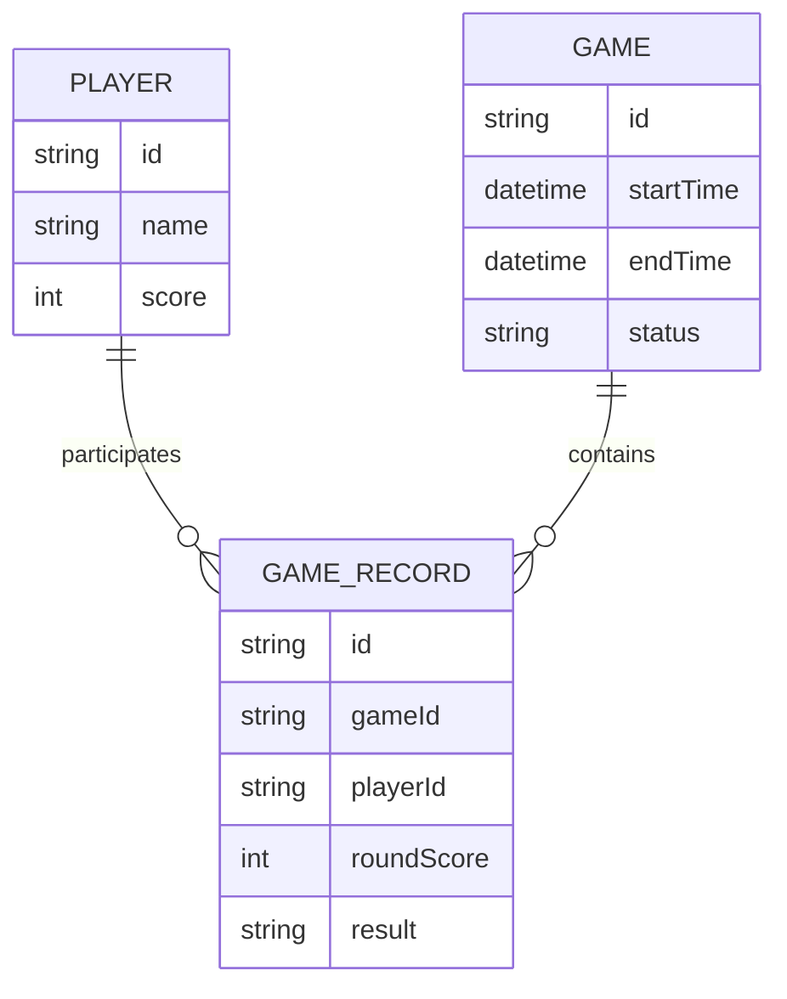

## 1. 架構設計



## 2. 技術描述

- **前端**：React@18 + TypeScript + Tailwind CSS + Vite
- **初始化工具**：vite-init
- **後端**：無（純前端應用）
- **數據存儲**：LocalStorage（本地存儲遊戲記錄和排行榜）

## 3. 路由定義

| 路由 | 用途 |
|------|------|
| / | 首頁 - 玩家管理 |
| /game | 遊戲計分頁面 |
| /leaderboard | 排行榜頁面 |
| /history | 遊戲記錄頁面 |

## 4. API 定義
無後端，所有邏輯在前端實現。

## 5. 數據模型

### 6.1 數據模型定義



### 6.2 數據結構

```typescript
interface Player {
  id: string;
  name: string;
  score: number;
}

interface GameRecord {
  id: string;
  date: Date;
  players: Player[];
  rounds: Round[];
}

interface Round {
  roundNumber: number;
  playerScores: { [playerId: string]: number };
  dealerScore?: number;
  timestamp: Date;
}
```

## 6. 技術要點

- 使用 Zustand 管理全局狀態（玩家、遊戲進度、分數）
- LocalStorage 持久化存儲遊戲記錄和排行榜
- Tailwind CSS 負責響應式布局和樣式
- 使用 lucide-react 提供精美圖標
