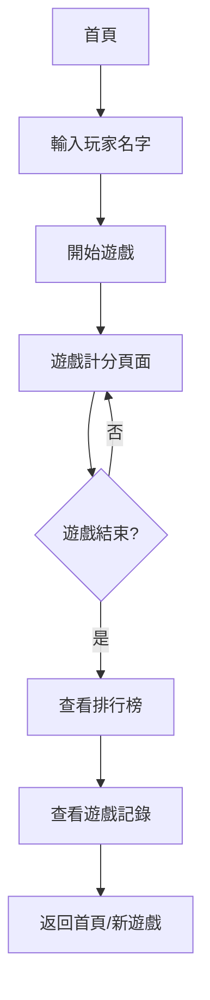

## 1. 產品概述

這是一款精緻的計分器應用，專為紙牌遊戲（特別是21點）和桌面遊戲設計，提供精準的自動計分功能，幫助玩家記錄每一局遊戲的輝煌時刻。

- 解決玩家手動計分易出錯、記錄不全的問題
- 適用於家庭聚會、朋友間的紙牌遊戲活動
- 目標是讓玩家能夠專注於遊戲，而無需擔心記分問題

## 2. 核心功能

### 2.1 用戶角色
| 角色 | 註冊方式 | 核心權限 |
|------|----------|----------|
| 一般玩家 | 無需註冊，直接輸入名字即可使用 | 所有功能，包括遊戲管理、計分、排行榜查看 |

### 2.2 功能模組
1. **首頁/遊戲頁面**：玩家管理、遊戲開始、遊戲介面
2. **計分頁面**：21點遊戲計分、得分調整
3. **排行榜頁面**：玩家排名展示
4. **遊戲記錄頁面**：歷史遊戲記錄查詢

### 2.3 頁面詳情
| 頁面名稱 | 模組名稱 | 功能描述 |
|---------|----------|---------|
| 首頁 | 玩家管理 | 輸入玩家姓名，設置遊戲人數 |
| 計分頁面 | 遊戲計分 | 21點遊戲自動計分，支持玩家得分+2/+1/-1調整 |
| 排行榜 | 排名展示 | 按玩家得分排序，顯示冠亞季軍 |
| 遊戲記錄 | 歷史記錄 | 記錄每局遊戲的詳細數據 |

## 3. 核心流程

玩家流程：開局輸入玩家姓名 → 開始遊戲 → 進行21點遊戲並計分 → 查看排行榜 → 保存遊戲記錄

## 4. 用戶界面設計

### 4.1 設計風格
- **主色調**：墨綠色（象徵紙牌遊戲的經典）搭配金色點綴
- **按鈕風格**：立體圓角按鈕，有柔和的陰影效果
- **字體**：Playfair Display（標題）搭配 Noto Sans TC（正文）
- **佈局風格**：卡片式設計，清晰的層次結構
- **圖標/表情**：使用紙牌、皇冠、獎盃等遊戲相關圖標

### 4.2 頁面設計概述
| 頁面名稱 | 模組名稱 | UI元素 |
|---------|----------|--------|
| 首頁 | Hero區域 | 大標題「掌控遊戲勝負，記錄每一刻輝煌」，漸層背景，卡片式佈局 |
| 計分頁面 | 遊戲介面 | 玩家卡片、得分顯示、計分按鈕、遊戲狀態 |
| 排行榜 | 排名展示 | 冠亞季軍特殊樣式、漸變色彩、動畫效果 |
| 遊戲記錄 | 記錄列表 | 時間軸樣式、每局記錄卡片 |

### 4.3 響應式設計
- 桌面優先，同時適配移動端
- 觸摸屏優化，大按鈕易於操作

### 4.4 視覺效果
- 卡片有柔和的陰影和圓角
- 得分變化時有平滑的動畫
- 排行榜有華麗的展示效果
- 使用細紋理背景增加質感
